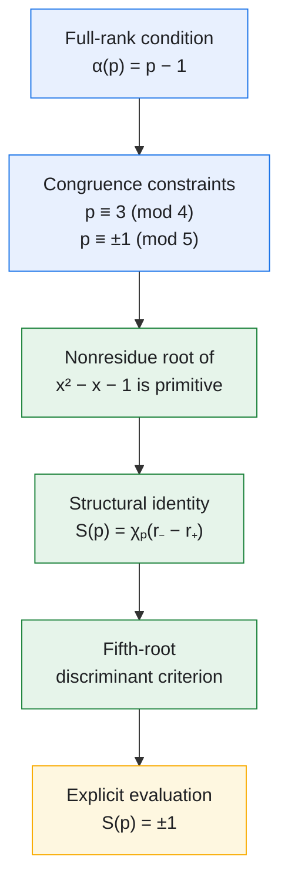
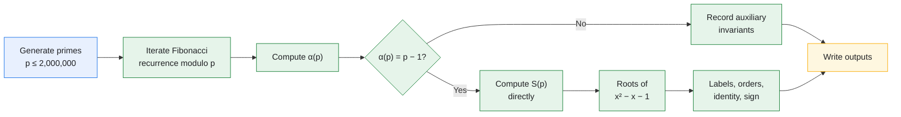

# An Explicit Evaluation of a Fibonacci Character Sum for Primes with Full Rank of Apparition

[](https://github.com/Majid-Ghandali/fibonacci-character-sum-full-rank/releases)
[](https://github.com/Majid-Ghandali/fibonacci-character-sum-full-rank/actions/workflows/self-test.yml)
[](https://doi.org/10.5281/zenodo.22803009)
[](https://doi.org/10.5281/zenodo.21431565)
[-yellow.svg)](LICENSE)
[-lightgrey.svg)](Manuscript/LICENSE)
[](https://www.python.org/)

> **Research compendium** — manuscript + verification code + evidence  
> **Majid Ghandali** · Independent Researcher, Tehran, Iran · 2026  
> Submitted to the *Journal of Number Theory*

> **License note.** Manuscript text under [`Manuscript/`](Manuscript/) is **CC BY 4.0**. Code, scripts, verification outputs, and computational artifacts are **MIT**. See [License](#license).

---

## Release status

| Item | Value |
|:--|:--|
| Code / archive release | FibChar **v1.0.1** · DOI [10.5281/zenodo.21431565](https://doi.org/10.5281/zenodo.21431565) |
| Manuscript preprint | **v1.0.0** (2026-09-16) · DOI [10.5281/zenodo.22803009](https://doi.org/10.5281/zenodo.22803009) |
| Preprint concept DOI | [10.5281/zenodo.22803008](https://doi.org/10.5281/zenodo.22803008) |
| Verification bound | every prime \(p\le 2{,}000{,}000\) |
| Headline snapshot | [`verification/corollary_B1_verification.csv`](verification/corollary_B1_verification.csv) |

**Cite math** → manuscript DOI. **Cite software / data / re-runs** → code DOI. The two Zenodo records are independent.

**Key paths:** [theorem source](Manuscript/main_full_rank.tex) · [program](Code/Fibchar_v1-0-1.py) · [CSV snapshot](verification/corollary_B1_verification.csv) · [Code/README](Code/README.md) · [verification/README](verification/README.md)

---

## Quick start

```bash
git clone https://github.com/Majid-Ghandali/fibonacci-character-sum-full-rank.git
cd fibonacci-character-sum-full-rank
python -m venv .venv
source .venv/bin/activate          # macOS/Linux
# .\.venv\Scripts\Activate.ps1     # Windows PowerShell
python -m pip install -r requirements.txt

# Fast check (~instant): five Appendix-A primes, four invariants each
python Code/Fibchar_v1-0-1.py --no-gui --self-test
```

A successful self-test ends with:

```text
[OK] Self-test PASSED -- all 5 examples x 4 invariants verified.
```

A nonzero process exit status indicates failure. Exact table lines above that message list \(p\in\{11,19,31,59,79\}\).

Full verification through \(p=2{,}000{,}000\) is much longer:

```bash
python Code/Fibchar_v1-0-1.py --no-gui --N 2000000 --verify-b1
```

See [Usage](#usage) for options (`--parallel`, `--resume`, …).

---

## Overview

This repository holds the **preprint** (`Manuscript/`), the **FibChar** verification suite (`Code/`), a **committed headline snapshot** (`verification/`), and extended **run outputs** (`results/`).

The mathematical object is

$$
S(p)=\sum_{n=1}^{p-1}\chi_p(F_n)
$$

under the full-rank hypothesis \(\alpha(p)=p-1\).

> [!NOTE]
> **Status of statements in this README**
> - **Theorem** — proved in [`Manuscript/main_full_rank.tex`](Manuscript/main_full_rank.tex) (Main Theorem / `\Cref{thm:main}`).
> - **Computational verification** — checked for all primes \(p\le 2{,}000{,}000\); does not replace the proof.
> - **Empirical observation (E1–E10)** — logged for documentation only; **not** used in the proof.

### Notation

| Symbol | Meaning |
|:--|:--|
| \(F_n\) | Fibonacci sequence: \(F_0=0\), \(F_1=1\), \(F_{n+2}=F_{n+1}+F_n\) |
| \(\alpha(p)\) | Rank of apparition: least positive \(n\) with \(p\mid F_n\) |
| \(\chi_p(a)\) | Legendre symbol \(\bigl(\frac{a}{p}\bigr)\), with the convention \(\chi_p(0)=0\) |
| \(r_-,r_+\) | Roots of \(x^2-x-1\) in \(\mathbb{F}_p\), labeled nonresidue / residue |
| Split primes | Primes with \(\bigl(\frac{5}{p}\bigr)=1\) (equivalently \(x^2-x-1\) splits over \(\mathbb{F}_p\); \(p\equiv\pm1\pmod5\)) |

---

## Contents

- [Quick start](#quick-start)
- [Main Theorem](#main-theorem)
- [Verification Summary](#verification-summary)
- [Scientific Highlights](#scientific-highlights)
- [Proof Structure](#proof-structure)
- [Computational Pipeline](#computational-pipeline)
- [Project Structure](#project-structure)
- [Installation](#installation)
- [Usage](#usage)
- [Compile the manuscript](#compile-the-manuscript)
- [Structural Checks](#structural-checks)
- [Auxiliary Empirical Observations](#auxiliary-empirical-observations)
- [Zenodo Archive](#zenodo-archive)
- [Citation](#citation)
- [License](#license)
- [Author](#author)

---

## Main Theorem

> **Status:** proved in the manuscript. Repository checks hold only for the finite range below.

Let \(p\ge7\) be a prime with \(\alpha(p)=p-1\). Then

$$
p\equiv11\pmod{20}\quad\text{or}\quad p\equiv19\pmod{20},
$$

and

$$
S(p)=\sum_{n=1}^{p-1}\chi_p(F_n)
=
\begin{cases}
+1, & p\equiv11\pmod{20},\\[2mm]
-1, & p\equiv19\pmod{20}.
\end{cases}
$$

Equivalently, \(S(p)=\chi_p(r_--r_+)\). Full rank forces \(r_-\) to be primitive in \(\mathbb{F}_p^\times\), which yields the structural reduction used in the proof (see the manuscript, Main Theorem and the surrounding lemmas/propositions).

---

## Verification Summary

> **Status:** computational verification for \(p\le 2{,}000{,}000\).

| Quantity | Value |
|:--|--:|
| Primes tested | 148,933 |
| Split primes \(p\equiv\pm1\pmod{5}\) | 74,461 |
| Full-rank primes \(\alpha(p)=p-1\) | 26,407 |
| Density among split primes | \(26{,}407/74{,}461\approx35.46\%\) |
| Matches to the main theorem | 26,407 |
| Violations | **0** |

**Traceability.** The class counts \(11{,}755\) (\(p\equiv11\pmod{20}\)) and \(14{,}652\) (\(p\equiv19\pmod{20}\)), each with zero mismatches, are stored in:

[`verification/corollary_B1_verification.csv`](verification/corollary_B1_verification.csv)

Regenerate (long run) with:

```bash
python Code/Fibchar_v1-0-1.py --no-gui --N 2000000 --verify-b1
```

The check is **non-circular**: \(\alpha(p)\) and \(S(p)\) come from the recurrence and the defining sum; the closed formula is only a comparison target.

| Reproducibility item | Value |
|:--|:--|
| Python | 3.11+ recommended (CI uses 3.12) |
| Dependencies | [`requirements.txt`](requirements.txt) |
| Self-test | deterministic; five fixed primes |
| Full run to \(2\times10^6\) | optional `--parallel`; wall-clock depends on hardware (not fixed here) |
| Reference snapshot | [`verification/`](verification/) |
| Full archival deposit | DOI [10.5281/zenodo.21431565](https://doi.org/10.5281/zenodo.21431565) |

---

## Scientific Highlights

| | Result |
|:--|:--|
| **Object** | Quadratic-character sums of Fibonacci values |
| **Hypothesis** | \(\alpha(p)=p-1\) |
| **Congruence** | \(p\equiv11\) or \(19\pmod{20}\) |
| **Mechanism** | Nonresidue root of \(x^2-x-1\) is primitive in \(\mathbb{F}_p^\times\) |
| **Identity** | \(S(p)=\chi_p(r_--r_+)\) |
| **Evaluation** | \(+1\) / \(-1\) by \(p\bmod20\) |
| **Checked range** | all primes \(p\le2{,}000{,}000\) |

---

## Proof Structure



---

## Computational Pipeline



Quadratic characters may use QR tables, bitwise Jacobi, or Euler’s criterion.

---

## Project Structure

```text
.
├── Manuscript/                 # Preprint (CC BY 4.0)
│   ├── main_full_rank.tex
│   ├── references_full_rank.bib
│   ├── main_full_rank.pdf
│   └── LICENSE
├── Code/                       # Suite (MIT)
│   ├── Fibchar_v1-0-1.py       # entry point
│   └── README.md
├── verification/               # Headline snapshot
│   ├── corollary_B1_verification.csv
│   └── README.md
├── results/                    # Extended artifacts (MIT as computational output)
├── .github/workflows/self-test.yml
├── CITATION.cff
├── LICENSE                     # MIT
├── requirements.txt
├── compile.ps1 / compile.sh
└── README.md
```

Paths `Manuscript/` and `Code/` are case-sensitive.

---

## Installation

```bash
git clone https://github.com/Majid-Ghandali/fibonacci-character-sum-full-rank.git
cd fibonacci-character-sum-full-rank
python -m venv .venv
source .venv/bin/activate   # Windows: .\.venv\Scripts\Activate.ps1
python -m pip install --upgrade pip
python -m pip install -r requirements.txt
```

---

## Usage

```bash
python Code/Fibchar_v1-0-1.py --no-gui --self-test
python Code/Fibchar_v1-0-1.py --no-gui --N 2000000 --verify-b1
python Code/Fibchar_v1-0-1.py --no-gui --N 2000000 --verify-b1 --parallel --workers 8
python Code/Fibchar_v1-0-1.py --help
```

Details: [`Code/README.md`](Code/README.md). Bulk archives: [`results/`](results/) and DOI `10.5281/zenodo.21431565`.

---

## Compile the manuscript

```powershell
.\compile.ps1
```

```bash
./compile.sh
```

Or from `Manuscript/`: `pdflatex` → `bibtex` → `pdflatex` ×2 (needs `elsarticle`).

---

## Structural Checks

> **Status:** computational verification on the full-rank set up to \(2\times10^6\).

For each such prime the suite checks splitting of \(x^2-x-1\); residue labels; \(\operatorname{ord}(-r_-^2)=p-1\); primitivity of \(r_-\); \(S(p)=\chi_p(r_--r_+)\); and the discriminant sign. **Zero exceptions** in that range.

---

## Auxiliary Empirical Observations

> **Status:** empirical observation only — **not** used in the proof of the main theorem.

| Label | Description |
|:--|:--|
| E1 | \(v_2(\pi)=v_2(p+1)+1\) on `DI` |
| E2 | \(\pi=4\alpha\), \(\alpha\) odd on \(Z\setminus\mathrm{DI}\) |
| E3 | \(\pi=\alpha\) on `cm_only` |
| E4 | \(\alpha\mid(p+1)\) for inert primes |
| E5 | \(\alpha\mid(p-1)\) for split primes |
| E6–E7 | Parity laws for an exponent \(k\) via \(\chi_p(-1)\) |
| E8 | Full-rank sign pattern on the relevant class |
| E9–E10 | Further regularities on selected subclasses |

Labels `DI`, `Z`, `cm_only` are those used in the verification logs.

---

## Zenodo Archive

| Record | DOI |
|:--|:--|
| Manuscript v1.0.0 | [10.5281/zenodo.22803009](https://doi.org/10.5281/zenodo.22803009) |
| Manuscript concept | [10.5281/zenodo.22803008](https://doi.org/10.5281/zenodo.22803008) |
| Code FibChar v1.0.1 | [10.5281/zenodo.21431565](https://doi.org/10.5281/zenodo.21431565) |

The **code concept DOI** (always the latest code version) appears on the Zenodo page for `21431565` under *Versions* / *Cite as*. Copy it from that UI when needed; do not invent it.

Future code tags (`v1.0.2`, …) should update the version DOI in this README after Zenodo mints them. The preprint DOI stays fixed unless the text is re-deposited.

---

## Citation

Cite the preprint for mathematics and the code archive for software/data when both are used. Machine-readable preprint metadata: [`CITATION.cff`](CITATION.cff).

```bibtex
@misc{Ghandali2026Preprint,
  author       = {Ghandali, Majid},
  title        = {An Explicit Evaluation of a {F}ibonacci Character Sum for
                  Primes with Full Rank of Apparition},
  year         = {2026},
  version      = {v1.0.0},
  howpublished = {Zenodo preprint},
  doi          = {10.5281/zenodo.22803009},
  url          = {https://doi.org/10.5281/zenodo.22803009},
  note         = {Submitted to the Journal of Number Theory}
}
```

```bibtex
@misc{Ghandali2026,
  author       = {Ghandali, Majid},
  title        = {{FibChar v1.0.1}: Reproducibility Materials for
                  ``An Explicit Evaluation of a {F}ibonacci Character Sum
                  for Primes with Full Rank of Apparition''},
  howpublished = {Zenodo},
  year         = {2026},
  version      = {v1.0.1},
  doi          = {10.5281/zenodo.21431565},
  url          = {https://doi.org/10.5281/zenodo.21431565},
  note         = {Reproducibility archive}
}
```

The key `Ghandali2026` matches [`Manuscript/references_full_rank.bib`](Manuscript/references_full_rank.bib).

---

## License

Copyright (C) 2026 Majid Ghandali.

| Content | Path | License |
|:--|:--|:--|
| Software, scripts, verification outputs, computational artifacts (including `results/` as generated data) | `Code/`, `verification/`, `results/`, tooling | **[MIT](LICENSE)** |
| Manuscript (LaTeX, `.bib`, PDF) | [`Manuscript/`](Manuscript/) | **[CC BY 4.0](Manuscript/LICENSE)** |

---

## Author

**Majid Ghandali** · Independent Researcher, Tehran, Iran  

Email: [majid.ghandali@gmail.com](mailto:majid.ghandali@gmail.com) · ORCID: [0009-0001-1097-1770](https://orcid.org/0009-0001-1097-1770)
