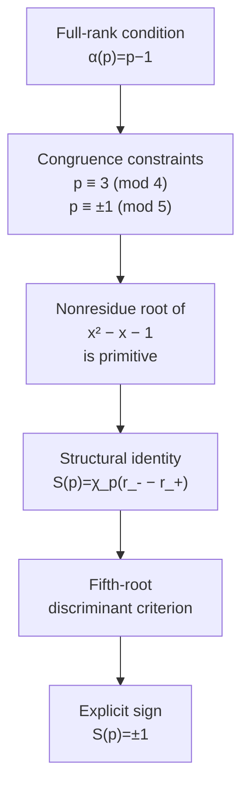

# An Explicit Evaluation of a Fibonacci Character Sum for Primes with Full Rank of Apparition

[](https://doi.org/10.5281/zenodo.20707467)
[](LICENSE)
[](https://www.python.org/)
[](https://doi.org/10.5281/zenodo.20707467)
[](https://github.com/Majid-Ghandali/fibonacci-character-sum-full-rank)

Companion repository for the paper

> **An Explicit Evaluation of a Fibonacci Character Sum for Primes with Full Rank of Apparition**  
> Majid Ghandali, 2026

This repository contains the manuscript source, computational verification code, datasets, logs, and reproducibility materials associated with the paper.

---

## Abstract

For an odd prime $p$, let $\chi_p$ denote the quadratic character modulo $p$, and define

$$
S(p)=\sum_{n=1}^{p-1}\chi_p(F_n),
$$

where $(F_n)$ is the Fibonacci sequence. Let $\alpha(p)$ denote the rank of apparition of $p$, namely the least positive integer $m$ such that $p\mid F_m$.

The paper proves that if

$$
\alpha(p)=p-1,
$$

then necessarily

$$
p\equiv 11 \pmod{20}
$$\qquad\text{or}\qquad$$
p\equiv 19 \pmod{20},
$$

and moreover

$$
S(p)=
\begin{cases}
+1,& p\equiv 11\pmod{20},\\[2mm]
-1,& p\equiv 19\pmod{20}.
\end{cases}
$$

The proof shows that, in the full-rank regime, the quadratic nonresidue root $r_-$ of

$$
x^2-x-1
$$

becomes a primitive root of $\mathbb F_p^\times$. This permits a primitive-root reindexing of the Fibonacci character sum and yields the structural identity

$$
S(p)=\chi_p(r_- - r_+),
$$

where $r_+$ is the quadratic residue root. The final sign is determined by a discriminant criterion related to fifth roots of unity in $\mathbb F_p$.

---

## Main Theorem

Let $p\ge 7$ be a prime such that

$$
\alpha(p)=p-1.
$$

Then

$$
p\equiv 11 \pmod{20}
$$\qquad\text{or}\qquad$$
p\equiv 19 \pmod{20},
$$

and

$$
S(p)=\sum_{n=1}^{p-1}\chi_p(F_n)=
\begin{cases}
+1,& p\equiv 11\pmod{20},\\[2mm]
-1,& p\equiv 19\pmod{20}.
\end{cases}
$$

---

## Proof Structure

The computational artifact mirrors the logical structure of the proof.



---

## Verification Summary

The verification was carried out for all primes $p\le 2{,}000{,}000$.

| Quantity | Value |
| --- | ---: |
| Prime bound | $p\le 2{,}000{,}000$ |
| Primes tested | $148{,}933$ |
| Split primes $p\equiv \pm1\pmod 5$ | $74{,}461$ |
| Full-rank primes $\alpha(p)=p-1$ | $26{,}407$ |
| Full-rank density among split primes | $26{,}407/74{,}461\approx 35.46\%$ |
| Main-theorem matches | $26{,}407$ |
| Main-theorem violations | $0$ |

The verification is non-circular: the code computes $\alpha(p)$ by iterating the Fibonacci recurrence modulo $p$, and computes $S(p)$ by directly summing $\chi_p(F_n)$ for $1\le n\le p-1$, without using the closed formula of the theorem.

---

## Repository Layout

```text
.
├── paper/
│   ├── LaTeX source of the manuscript
│   ├── bibliography
│   └── submission-related files
│
├── code/
│   ├── Python verification scripts
│   ├── rank-of-apparition computations
│   ├── Fibonacci character-sum evaluation
│   └── diagnostic checks
│
├── data/
│   ├── prime lists
│   ├── computed invariants
│   ├── intermediate tables
│   └── reproducibility metadata
│
├── results/
│   ├── CSV outputs
│   ├── TXT reports
│   ├── XLSX tables
│   ├── verification logs
│   └── publication-ready artifacts
│
└── docs/
    ├── reproducibility guide
    ├── implementation notes
    ├── version history
    └── project documentation
```

---

## Code Organization Note

The current archived code is preserved in the form used for the verification run. It is intended as a reproducibility artifact rather than as an installable Python package.

A future version may refactor the verification scripts into a more modular package structure. Such refactoring will be documented separately and will not change the reproducibility record of the archived verification run.

---

## Reproducibility

The verification framework computes, for each prime $p\le 2{,}000{,}000$:

1. the rank of apparition $\alpha(p)$;
2. the Fibonacci character sum

$$
S(p)=\sum_{n=1}^{p-1}\chi_p(F_n);
$$

3. the congruence class of $p$ modulo $20$;
4. the root/order/sign checks associated with the proof mechanism.

To evaluate the quadratic character efficiently, the implementation supports interchangeable methods, including:

- quadratic-residue lookup tables;
- bitwise Jacobi-symbol computation;
- modular exponentiation via Euler's criterion.

The verification outputs include:

- complete prime lists;
- computed values of $\alpha(p)$;
- computed values of $S(p)$;
- diagnostic tables;
- checkpoint files;
- execution logs;
- empirical verification reports.

For full implementation details and output descriptions, see:

```text
docs/reproducibility.md
```

---

## Installation and Basic Usage

Clone the repository:

```bash
git clone https://github.com/Majid-Ghandali/fibonacci-character-sum-full-rank.git
cd fibonacci-character-sum-full-rank
```

Create and activate a virtual environment if desired:

```bash
python -m venv .venv
```

On Windows PowerShell:

```powershell
.\.venv\Scripts\Activate.ps1
```

On macOS/Linux:

```bash
source .venv/bin/activate
```

Install dependencies:

```bash
pip install -r requirements.txt
```

Run the verification suite:

```bash
python code/main.py
```

If the entry-point script is renamed in a later refactor, follow the exact instructions in:

```text
docs/reproducibility.md
```

The full verification up to $2{,}000{,}000$ primes may take time depending on hardware. The archived outputs are stored in `results/`.

---

## Structural Checks

In addition to verifying the numerical value of $S(p)$, the computation checks the structural mechanism used in the proof.

For every full-rank prime in the tested range, the verification confirms:

- the splitting of $x^2-x-1$ over $\mathbb F_p$;
- the residue/nonresidue labeling of the two roots;
- the identity $\operatorname{ord}(-r_-^2)=p-1$;
- the primitivity of $r_-$ in $\mathbb F_p^\times$;
- the structural identity

$$
S(p)=\chi_p(r_- - r_+);
$$

- the sign predicted by the fifth-root discriminant criterion.

All checks passed with zero exceptions for primes $p\le 2{,}000{,}000$ satisfying $\alpha(p)=p-1$.

---

## Auxiliary Empirical Observations

The verification logs also contain auxiliary empirical observations, labeled `E1`--`E10`, from the broader computational study. These observations are included for documentation and reproducibility purposes and are logically separate from the proof of the main theorem.

The class labels such as `DI`, `Z`, and `cm_only` are those used in the verification logs.

| Label | Description |
| --- | --- |
| `E1` | $v_2(\pi)=v_2(p+1)+1$ on `DI` |
| `E2` | $\pi=4\alpha$ and $\alpha$ is odd on $Z\setminus DI$ |
| `E3` | $\pi=\alpha$ on `cm_only` |
| `E4` | $\alpha\mid(p+1)$ for inert primes |
| `E5` | $\alpha\mid(p-1)$ for split primes |
| `E6` | parity law for exponent $k$ controlled by $\chi_p(-1)$ |
| `E7` | complementary parity law for exponent $k$ |
| `E8` | full-rank sign theorem on the relevant full-rank class |
| `E9` | additional structural regularities on selected subclasses |
| `E10` | additional informational regularities on selected subclasses |

The main theorem of the paper is the proved full-rank identity for $S(p)$; the additional observations are retained as reproducibility records and possible directions for further investigation.

---

## Archived Release and Zenodo Integration

This repository is archived through Zenodo.

Current archived DOI:

```text
10.5281/zenodo.20707467
```

DOI link:

<https://doi.org/10.5281/zenodo.20707467>

The archived release contains the version of the code, data, and documentation used for the reproducibility record.

For a new archived version:

1. commit the updated manuscript, bibliography, code, and documentation;
2. create a new Git tag, for example:

```bash
git tag -a v1.0.1 -m "Version 1.0.1: final corrected reproducibility archive"
git push origin v1.0.1
```

3. create a GitHub Release from that tag;
4. Zenodo will snapshot the release automatically if the repository is linked to Zenodo;
5. update the DOI badge and citation metadata if Zenodo assigns a new version DOI.

---

## Citation

If you use this repository, please cite both the manuscript and the archived computational artifact.

Citation metadata is provided in:

```text
CITATION.cff
```

A BibTeX entry for the reproducibility archive is:

```bibtex
@misc{Ghandali2026Archive,
  author       = {Ghandali, Majid},
  title        = {Reproducibility Archive for ``An Explicit Evaluation of a {F}ibonacci Character Sum for Primes with Full Rank of Apparition''},
  howpublished = {Zenodo},
  year         = {2026},
  note         = {Version v1.0.1},
  doi          = {10.5281/zenodo.20707467},
  url          = {https://doi.org/10.5281/zenodo.20707467}
}
```

If citing the mathematical result, please cite the accompanying paper:

```bibtex
@misc{Ghandali2026Paper,
  author = {Ghandali, Majid},
  title  = {An Explicit Evaluation of a {F}ibonacci Character Sum for Primes with Full Rank of Apparition},
  year   = {2026},
  note   = {Manuscript}
}
```

---

## License

This project is released under the MIT License.

See:

```text
LICENSE
```

for details.

---

## Author

Majid Ghandali  
Independent Researcher
