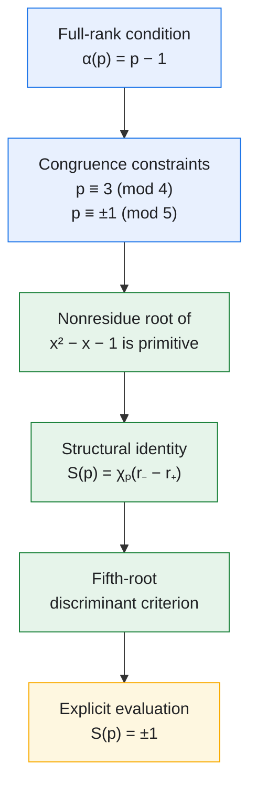
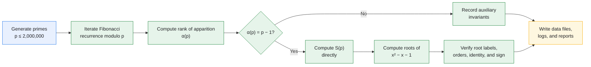

# An Explicit Evaluation of a Fibonacci Character Sum for Primes with Full Rank of Apparition

[](https://github.com/Majid-Ghandali/fibonacci-character-sum-full-rank/releases)
[](https://doi.org/ZENODO_VERSION_DOI)
[](https://doi.org/ZENODO_CONCEPT_DOI)
[](LICENSE)
[](https://www.python.org/)
[](https://github.com/Majid-Ghandali/fibonacci-character-sum-full-rank/releases)

> **Companion repository for the manuscript**  
> *An Explicit Evaluation of a Fibonacci Character Sum for Primes with Full Rank of Apparition*  
>
> **Majid Ghandali** · Independent Researcher · 2026  
> **Manuscript (2026)**

---

## Overview

This repository contains the manuscript source, computational verification code, datasets, logs, results, and reproducibility materials associated with the accompanying mathematical manuscript.

The project concerns the quadratic-character sum

$$
S(p)=\sum_{n=1}^{p-1}\chi_p(F_n),
$$

where $(F_n)$ is the Fibonacci sequence and $\chi_p$ is the quadratic character modulo an odd prime $p$.

The main result gives an explicit evaluation of this sum in the **full-rank regime**

$$
\alpha(p)=p-1,
$$

where $\alpha(p)$ is the rank of apparition of $p$.

> [!NOTE]
> The computations in this repository verify the stated identities and implementation across a specified finite range. They support reproducibility, but the mathematical results are proved in the accompanying manuscript.

---

## Contents

- [Scientific Highlights](#scientific-highlights)
- [Main Theorem](#main-theorem)
- [Proof Structure](#proof-structure)
- [Verification Summary](#verification-summary)
- [Computational Pipeline](#computational-pipeline)
- [Reproducibility](#reproducibility)
- [Project Structure](#project-structure)
- [Installation](#installation)
- [Usage](#usage)
- [Structural Checks](#structural-checks)
- [Auxiliary Empirical Observations](#auxiliary-empirical-observations)
- [Zenodo Archive](#zenodo-archive)
- [Citation](#citation)
- [License](#license)
- [Author](#author)

---

## Scientific Highlights

| | Result |
|:--|:--|
| **Object** | Quadratic-character sums attached to Fibonacci values |
| **Hypothesis** | Full rank of apparition: $\alpha(p)=p-1$ |
| **Congruence consequence** | $p\equiv 11$ or $19\pmod{20}$ |
| **Structural mechanism** | The nonresidue root of $x^2-x-1$ becomes primitive in $\mathbb F_p^\times$ |
| **Character-sum identity** | $S(p)=\chi_p(r_--r_+)$ |
| **Explicit evaluation** | $S(p)=+1$ for $p\equiv11\pmod{20}$ and $S(p)=-1$ for $p\equiv19\pmod{20}$ |
| **Verification range** | Every prime $p\le2{,}000{,}000$ |

The proof mechanism combines the arithmetic of the roots of

$$
x^2-x-1
$$

over $\mathbb F_p$, a primitive-root reindexing of the Fibonacci sequence, and a discriminant criterion associated with fifth roots of unity.

---

## Main Theorem

Let $p\ge7$ be a prime satisfying

$$
\alpha(p)=p-1.
$$

Then

$$
p\equiv11\pmod{20}
$$\qquad\text{or}\qquad$$
p\equiv19\pmod{20},
$$

and

$$
S(p)=\sum_{n=1}^{p-1}\chi_p(F_n)
=
\begin{cases}
+1, & p\equiv11\pmod{20},\\[2mm]
-1, & p\equiv19\pmod{20}.
\end{cases}
$$

More structurally, if $r_-$ is the quadratic nonresidue root of $x^2-x-1$ in $\mathbb F_p$, and $r_+$ is the quadratic residue root, then

$$
S(p)=\chi_p(r_--r_+).
$$

The full-rank hypothesis forces $r_-$ to be a primitive root of $\mathbb F_p^\times$. This is the key mechanism that makes the explicit evaluation possible.

---

## Proof Structure


```mermaid
flowchart TD
    A["Full-rank condition<br/>α(p) = p − 1"]
    B["Congruence constraints<br/>p ≡ 3 (mod 4)<br/>p ≡ ±1 (mod 5)"]
    C["Nonresidue root of<br/>x² − x − 1 is primitive"]
    D["Structural identity<br/>S(p) = χₚ(r₋ − r₊)"]
    E["Fifth-root<br/>discriminant criterion"]
    F["Explicit evaluation<br/>S(p) = ±1"]

    A --> B
    B --> C
    C --> D
    D --> E
    E --> F

    classDef condition fill:#E8F0FE,stroke:#1A73E8,color:#202124;
    classDef mechanism fill:#E6F4EA,stroke:#188038,color:#202124;
    classDef conclusion fill:#FEF7E0,stroke:#F9AB00,color:#202124;

    class A,B condition;
    class C,D,E mechanism;
    class F conclusion;
```

---

## Verification Summary

The verification was carried out for **every prime**

$$
p\le2{,}000{,}000.
$$

| Quantity | Value |
|:--|--:|
| Prime bound | $p\le2{,}000{,}000$ |
| Primes tested | 148,933 |
| Split primes $p\equiv\pm1\pmod 5$ | 74,461 |
| Full-rank primes $\alpha(p)=p-1$ | 26,407 |
| Full-rank density among split primes | $26{,}407/74{,}461\approx35.46\%$ |
| Main-theorem matches | 26,407 |
| Main-theorem violations | **0** |

> [!TIP]
> **All structural identities appearing in the proof were also verified computationally over the same range.**

The verification is deliberately **non-circular**:

- $\alpha(p)$ is computed by direct iteration of the Fibonacci recurrence modulo $p$;
- $S(p)$ is computed directly from
  $$
  \sum_{n=1}^{p-1}\chi_p(F_n);
  $$
- the closed formula from the theorem is used only as a comparison target, never as input to the calculation.

---

## Computational Pipeline


```mermaid
flowchart LR
    A["Generate primes<br/>p ≤ 2,000,000"]
    B["Iterate Fibonacci<br/>recurrence modulo p"]
    C["Compute rank of apparition<br/>α(p)"]
    D{"α(p) = p − 1?"}
    E["Record auxiliary<br/>invariants"]
    F["Compute S(p)<br/>directly"]
    G["Compute roots of<br/>x² − x − 1"]
    H["Verify root labels,<br/>orders, identity, and sign"]
    I["Write data files,<br/>logs, and reports"]

    A --> B --> C --> D
    D -- No --> E --> I
    D -- Yes --> F --> G --> H --> I

    classDef input fill:#E8F0FE,stroke:#1A73E8,color:#202124;
    classDef process fill:#E6F4EA,stroke:#188038,color:#202124;
    classDef output fill:#FEF7E0,stroke:#F9AB00,color:#202124;

    class A input;
    class B,C,D,E,F,G,H process;
    class I output;
```

---

## Reproducibility

> [!IMPORTANT]
> Python **3.11 or later** is recommended.

For each prime $p\le2{,}000{,}000$, the framework computes or verifies:

1. the rank of apparition $\alpha(p)$;
2. the direct Fibonacci character sum
   $$
   S(p)=\sum_{n=1}^{p-1}\chi_p(F_n);
   $$
3. the residue class of $p$ modulo $20$;
4. the roots of $x^2-x-1$ whenever the polynomial splits over $\mathbb F_p$;
5. the quadratic residue/nonresidue labels of the roots;
6. multiplicative orders and primitive-root conditions;
7. the structural identity
   $$
   S(p)=\chi_p(r_--r_+);
   $$
8. the sign determined by the fifth-root discriminant criterion.

### Quadratic-character implementations

The code supports interchangeable methods for evaluating quadratic characters:

- quadratic-residue lookup tables;
- bitwise Jacobi-symbol computation;
- modular exponentiation via Euler's criterion.

### Archived outputs

The reproducibility archive includes:

- complete prime lists;
- computed ranks of apparition;
- directly evaluated Fibonacci character sums;
- diagnostic tables;
- checkpoint files;
- execution logs;
- empirical verification reports;
- publication-ready CSV, TXT, and XLSX artifacts.

For detailed instructions and file descriptions, see:

➡️ [`docs/reproducibility.md`](docs/reproducibility.md)

---

## Project Structure

The repository is organized as follows.

```text
.
├── paper/                       # Manuscript and submission materials
│   ├── manuscript source files
│   ├── bibliography
│   ├── figures and tables
│   └── submission-related files
│
├── code/                        # Computational verification framework
│   ├── verification scripts
│   ├── rank-of-apparition computations
│   ├── Fibonacci character-sum evaluation
│   └── diagnostic and consistency checks
│
├── data/                        # Input and intermediate data
│   ├── prime lists
│   ├── computed invariants
│   ├── intermediate tables
│   └── reproducibility metadata
│
├── results/                     # Generated computational artifacts
│   ├── CSV outputs
│   ├── TXT reports
│   ├── XLSX tables
│   ├── verification logs
│   └── publication-ready artifacts
│
├── docs/                        # Documentation
│   ├── reproducibility guide
│   ├── implementation notes
│   ├── version history
│   └── project documentation
│
├── CITATION.cff
├── LICENSE
├── README.md
└── requirements.txt
```

---

## Installation

### 1. Clone the repository

```bash
git clone https://github.com/Majid-Ghandali/fibonacci-character-sum-full-rank.git
cd fibonacci-character-sum-full-rank
```

### 2. Create a virtual environment

```bash
python -m venv .venv
```

Activate it on **Windows PowerShell**:

```powershell
.\.venv\Scripts\Activate.ps1
```

Or on **macOS/Linux**:

```bash
source .venv/bin/activate
```

### 3. Install dependencies

```bash
python -m pip install --upgrade pip
python -m pip install -r requirements.txt
```

---

## Usage

Run the verification suite from the repository root:

```bash
python code/main.py
```

> [!NOTE]
> Full verification through $2{,}000{,}000$ may require substantial runtime, depending on the hardware and selected verification settings.

The archived outputs associated with the release are available in:

➡️ [`results/`](results/)

If the entry-point script is renamed in a later version, follow the release-specific instructions in:

➡️ [`docs/reproducibility.md`](docs/reproducibility.md)

---

## Structural Checks

In addition to direct evaluation of $S(p)$, the code verifies the structural mechanism used in the proof.

For every full-rank prime in the tested range, it confirms:

- [x] splitting of $x^2-x-1$ over $\mathbb F_p$;
- [x] residue/nonresidue labeling of the two roots;
- [x] the order identity
  $$
  \operatorname{ord}(-r_-^2)=p-1;
  $$
- [x] primitivity of $r_-$ in $\mathbb F_p^\times$;
- [x] the structural identity
  $$
  S(p)=\chi_p(r_--r_+);
  $$
- [x] the sign predicted by the fifth-root discriminant criterion.

> [!TIP]
> All listed checks passed with **zero exceptions** for primes $p\le2{,}000{,}000$ satisfying $\alpha(p)=p-1$.

---

## Auxiliary Empirical Observations

The verification logs additionally retain broader observations labelled **E1--E10**.

> [!WARNING]
> These observations are included for documentation, reproducibility, and possible future investigation.  
> **They are not used in the proof of the main theorem.**

| Label | Description |
|:--|:--|
| E1 | $v_2(\pi)=v_2(p+1)+1$ on `DI` |
| E2 | $\pi=4\alpha$ and $\alpha$ is odd on $Z\setminus\mathrm{DI}$ |
| E3 | $\pi=\alpha$ on `cm_only` |
| E4 | $\alpha\mid(p+1)$ for inert primes |
| E5 | $\alpha\mid(p-1)$ for split primes |
| E6 | Parity law for exponent $k$ controlled by $\chi_p(-1)$ |
| E7 | Complementary parity law for exponent $k$ |
| E8 | Full-rank sign theorem on the relevant full-rank class |
| E9 | Additional structural regularities on selected subclasses |
| E10 | Additional informational regularities on selected subclasses |

The identifiers `DI`, `Z`, and `cm_only` are the class labels used in the verification logs.

---

## Zenodo Archive

This repository is archived through [Zenodo](https://zenodo.org/).

| Archive identifier | DOI |
|:--|:--|
| **Current version DOI** | [`ZENODO_VERSION_DOI`](https://doi.org/ZENODO_VERSION_DOI) |
| **Concept DOI** | [`ZENODO_CONCEPT_DOI`](https://doi.org/ZENODO_CONCEPT_DOI) |

### DOI policy

- The **Version DOI** identifies one fixed and immutable archived release.
- The **Concept DOI** identifies the repository across all archived versions and resolves to the latest Zenodo release.
- For reproducibility and for citation in the manuscript, use the **Version DOI** corresponding exactly to the GitHub release used in the research.

### Creating a new archived release

1. Finalize `README.md`, `CITATION.cff`, `LICENSE`, manuscript files, code, data, results, and documentation.
2. Commit all release-ready changes.
3. Create and push an annotated version tag:

   ```bash
   git tag -a v1.1.0 -m "Version 1.1.0: final reproducibility archive"
   git push origin v1.1.0
   ```

4. Create a GitHub Release from that tag.
5. Confirm that Zenodo has archived the corresponding snapshot.
6. Record the new Zenodo **Version DOI** in the paper bibliography.
7. Compile the final manuscript PDF only after checking that the DOI resolves to the intended archived release.

---

## Citation

If this repository contributes to your research, please cite both:

1. the accompanying mathematical paper; and
2. the archived reproducibility package on Zenodo.

Citation metadata is available in:

➡️ [`CITATION.cff`](CITATION.cff)

### Reproducibility archive

```bibtex
@software{Ghandali2026FibonacciCharacterSumArchive,
  author    = {Ghandali, Majid},
  title     = {Reproducibility Archive for ``An Explicit Evaluation of a
               {F}ibonacci Character Sum for Primes with Full Rank of Apparition''},
  year      = {2026},
  version   = {v1.1.0},
  publisher = {Zenodo},
  doi       = {ZENODO_VERSION_DOI},
  url       = {https://doi.org/ZENODO_VERSION_DOI}
}
```

### Accompanying mathematical manuscript

```bibtex
@misc{Ghandali2026FibonacciCharacterSum,
  author = {Ghandali, Majid},
  title  = {An Explicit Evaluation of a {F}ibonacci Character Sum for
            Primes with Full Rank of Apparition},
  year   = {2026},
  note   = {Manuscript}
}
```

---

## License

This project is released under the [MIT License](LICENSE).

---

## Author

**Majid Ghandali**  
Independent Researcher  

📧 Email: [majid.ghandali@gmail.com](mailto:majid.ghandali@gmail.com)  
🆔 ORCID: [0009-0001-1097-1770](https://orcid.org/0009-0001-1097-1770)
