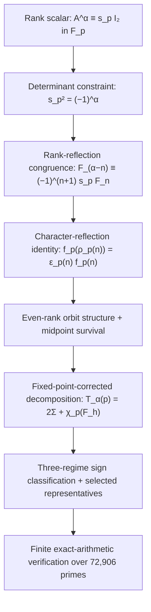
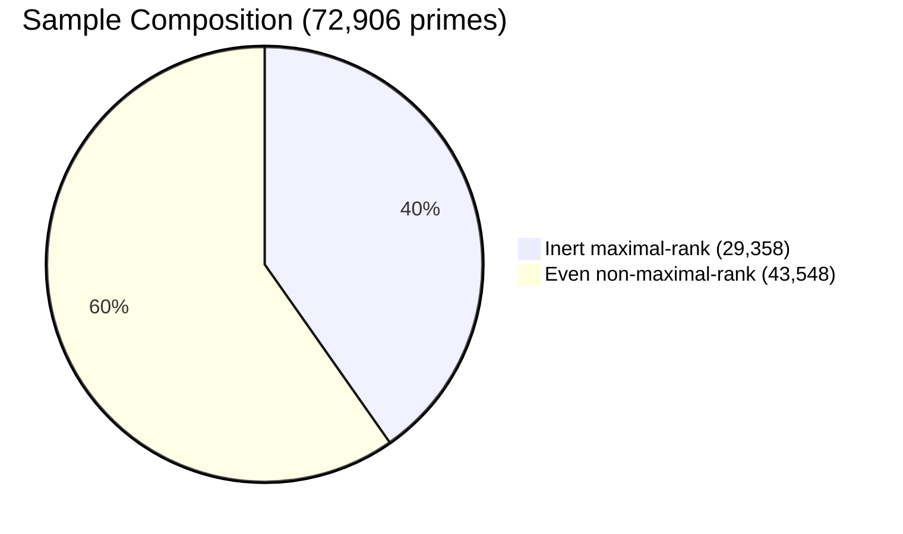
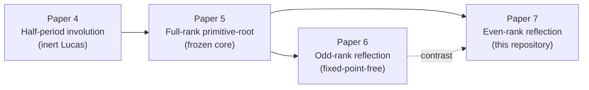

# Character-Twisted Reflection in Even-Rank Fibonacci Blocks

[](https://github.com/Majid-Ghandali/paper7-reflection-selection/releases)
[](LICENSE)
[](https://www.python.org/downloads/)
[](https://github.com/Majid-Ghandali/paper7-reflection-selection/releases)

> **Companion repository for the mathematical manuscript**
> *Character-Twisted Reflection in Even-Rank Fibonacci Blocks*
>
> **Majid Ghandali** · Independent Researcher · 2026
> **Current reproducibility release:** _pending first tagged release_
> **Citable archival DOI (this repository):** _to be assigned after final freeze — see [Important Distinctions](#important-distinctions)_
> **Inherited frozen-core DOI (Paper 5):** [10.5281/zenodo.21431565](https://doi.org/10.5281/zenodo.21431565) — *identifies the Paper 5 archive only, not this repository*

---

## Contents

- [Repository Purpose](#repository-purpose)
- [Scientific Highlights](#scientific-highlights)
- [Main Theorem](#main-theorem)
- [Abstract](#abstract)
- [Mathematical Scope](#mathematical-scope)
- [Scientific Context](#scientific-context)
- [Theoretical Results Verified Computationally](#theoretical-results-verified-computationally)
- [Verification Pipeline](#verification-pipeline)
- [Design Principles](#design-principles)
- [Installation](#installation)
- [Usage](#usage)
- [Official Run Configuration](#official-run-configuration)
- [Key Results](#key-results)
- [Scope Reconciliation (S3.1)](#scope-reconciliation-s31)
- [Outputs](#outputs)
- [Repository Structure](#repository-structure)
- [Frozen Core](#frozen-core)
- [Relationship to Companion Papers](#relationship-to-companion-papers)
- [Provenance](#provenance)
- [Hash Verification](#hash-verification)
- [Important Distinctions](#important-distinctions)
- [Reproducibility Policy](#reproducibility-policy)
- [Citation](#citation)
- [License](#license)
- [Author](#author)

---

## Repository Purpose

This repository contains only the computational components accompanying the manuscript. Mathematical definitions, proofs, and theoretical arguments are contained exclusively in the paper. The repository provides:

- executable reference implementation,
- exact-arithmetic verification,
- reproducibility artifacts,
- provenance records,

for all computational results that are reproduced by the accompanying software package.

> [!IMPORTANT]
> The mathematical results are proved in the accompanying manuscript.
> The computations in this repository verify the implementation, the stated identities, and the reproducibility of the reported finite-range calculations; they do not replace the proofs.

---

## Scientific Highlights

| Item | Description |
|:--|:--|
| **Object** | Rank-block character sum $T_\alpha(p)=\sum_{n=1}^{\alpha(p)}\chi_p(F_n)$ |
| **Hypothesis** | Even rank of apparition: $\alpha(p)=2h$ |
| **Structural mechanism** | Weighted character-reflection identity $f_p(\rho_p(n))=\varepsilon_p(n)\,f_p(n)$, with reflection multiplier governed by the rank scalar $s_p$ together with the parity of $n$ |
| **Key geometric fact** | Unique midpoint fixed point $h$; every other index pairs off under $n\mapsto\alpha(p)-n$ |
| **Main structural result** | Fixed-point-corrected decomposition of $T_\alpha(p)$ into selected lower-half pairs and a midpoint term |
| **Classification** | Explicit three-regime classification (U)/(O)/(E) of the selected index set $R_p$ |
| **Verification range** | Official finite sample of 72,906 primes $p\le2{,}000{,}000$ |

---

## Main Theorem

Let $p\ne2,5$ be a prime with even rank of apparition,

$$
\alpha(p)=2h.
$$

Let $s_p$ denote the rank scalar, let

$$
\varepsilon_p(n)=\chi_p\bigl((-1)^{n+1}\bigr)\chi_p(s_p),
$$

and let

$$
R_p=\{\,n\in\{1,\ldots,h-1\}:\varepsilon_p(n)=1\,\}.
$$

Then

$$
T_\alpha(p)=2\sum_{n\in R_p}\chi_p(\overline{F_n})+\chi_p(\overline{F_h}).
$$

Moreover, $R_p$ admits an explicit three-regime classification depending on $p\bmod4$ and the parity of $h$.

This is Theorem 5.4 (decomposition) together with Corollary 5.6 (classification) of the manuscript. For complete definitions, hypotheses, proofs, and bibliographic context, see the manuscript source in [`Paper/`](Paper/).

---

## Abstract

Let $p\ne2,5$ be a prime, let $\alpha(p)$ denote the rank of apparition of $p$ in the Fibonacci sequence. The paper studies the even-rank regime $\alpha(p) = 2h$, where the rank reflection $n \mapsto \alpha(p) - n$ has a unique midpoint fixed point $h$. A weighted character-reflection identity, whose reflection multiplier is determined by the rank scalar together with the parity of the index, yields a fixed-point-corrected decomposition of the rank-block character sum $T_\alpha(p)$ into selected lower-half pairs and a midpoint term. This repository provides a reproducible computational verification of these identities over the official sample of 72,906 primes $p \le 2{,}000{,}000$.

## Mathematical Scope

The repository verifies the computational components of the even-rank theory developed in the accompanying manuscript.

It does **not** attempt to verify:

- odd-rank theory,
- full-rank primitive-root theory,

except insofar as they are required by the inherited frozen computational core. No new mathematical claims are introduced in this repository.

## Scientific Context

The present repository belongs to a broader research program on quadratic-character sums over Fibonacci sequences. The companion papers are mathematically self-contained but share related themes and, where indicated, computational components. The repositories are designed to be independently reproducible and may be used separately:

| Paper | Focus | Repository |
|---|---|---|
| Paper 4 | Half-period involution in inert Lucas sequences | `lucas-half-period-involutions` |
| Paper 5 | Full-rank primitive-root character-sum evaluation | `fibchar` (frozen core) |
| Paper 6 | Odd-rank rank-block reflection | `paper6-odd-rank-reflection` |
| Paper 7 | Even-rank character-twisted reflection | this repository |

Paper 7 inherits the frozen computational core (`Fibchar_v1-0-1.py`) from Paper 5 and extends the reflection framework to the even-rank setting with a midpoint fixed point.

## Theoretical Results Verified Computationally

The repository reproduces the computational verification of the following theoretical results proved in the accompanying manuscript:

| Result | Ambient | Statement |
|---|---|---|
| Corollary 3.3 (B2) | $\mathbb{F}_p$ | $s_p^2 = (-1)^\alpha$ |
| Lemma 3.4 (B3) | $\mathbb{F}_p$ | $\overline{F_{\alpha-n}} = (-1)^{n+1}\, s_p\, \overline{F_n}$ |
| Theorem 4.1 (B5) | $\{\pm1\}$ | $f_p(\rho_p(n)) = \varepsilon_p(n)\, f_p(n)$ |
| Theorem 5.4 (C4) | $\mathbb{Z}$ | $T_\alpha(p) = 2\displaystyle\sum_{n \in R_p}\chi_p(\overline{F_n}) + \chi_p(\overline{F_h})$ |

## Verification Pipeline

The computational verification follows the logical dependency graph of the manuscript. The pipeline reflects the logical organization of the manuscript and is intended solely to document the computational workflow, not to replace or supplement the mathematical proofs.


```mermaid
graph TD
    A["Rank scalar: A^α ≡ s_p I₂ in F_p"] --> B["Determinant constraint: s_p² = (−1)^α"]
    B --> C["Rank-reflection congruence: F_(α−n) ≡ (−1)^(n+1) s_p F_n"]
    C --> D["Character-reflection identity: f_p(ρ_p(n)) = ε_p(n) f_p(n)"]
    D --> E["Even-rank orbit structure + midpoint survival"]
    E --> F["Fixed-point-corrected decomposition: T_α(p) = 2Σ + χ_p(F_h)"]
    F --> G["Three-regime sign classification + selected representatives"]
    G --> H["Finite exact-arithmetic verification over 72,906 primes"]
```

Each computational stage is verified independently in exact integer arithmetic and follows the logical dependency structure of the manuscript.

## Design Principles

The repository follows four design principles:

1. **Independent computational verification** — the implementation verifies the stated identities using exact arithmetic and is logically separate from the mathematical proofs presented in the manuscript.
2. **Frozen computational core** — the inherited Paper 5 core module is used as an immutable dependency without modification.
3. **Exact integer arithmetic** — no floating-point or approximate methods are used at any stage.
4. **Complete provenance** — every generated artifact is traceable to a documented execution with hash-verified source identity.

## Installation

Requirements: Python 3.10+ with `sympy`, `gmpy2`, and standard library modules.

```bash
git clone https://github.com/Majid-Ghandali/paper7-reflection-selection.git
cd paper7-reflection-selection
pip install -r code/requirements.txt
```

> [!NOTE]
> No tagged release has been published yet. Once a reproducibility release is tagged, this section will be updated with the corresponding `git checkout <tag>` step for exact correspondence with the archived version.

## Usage

Execute the main verification driver:

```bash
cd code
python Run_Reflection_Selection_Mechanism.py
```

Expected runtime: approximately 23 minutes with 14 workers.

Expected outputs:

```text
official_run/
    data/
    reports/
    provenance/
scope_reconciliation/
```

The driver generates all data, reports, and provenance artifacts in the output directory structure shown above.

## Official Run Configuration

```text
Driver:          Run_Reflection_Selection_Mechanism.py
Driver version:  v1-0-2
Frozen core:     Fibchar_v1-0-1.py (v1-0-1 token)
N_max:           2,000,000
Workers:         14
Strict mode:     True
Checkpoint:      sharded incremental
Arithmetic:      exact integer (no floating-point)
```

### Selection Predicate

$$
p \ne 2,5, \qquad \alpha(p) \equiv 0 \pmod{2}, \qquad \alpha(p) \ne p-1.
$$

### Finite Sample

The official finite computational sample consists of 72,906 primes satisfying the selection predicate up to $p \le 2{,}000{,}000$. The subsequent scope reconciliation separates the sample into maximal-rank and non-maximal-rank subclasses.

## Key Results

```text
Official finite sample count:       72,906
Validation failures:                0
Observed pair-law mismatches:       0
Rank-block phase time:              1392.0058 s
Checkpoint overhead:                2.7015 s
All validation predicates passed.
```

For every prime in the sample, the following checks passed:

- rank scalar computation ($s_p$),
- midpoint scalar identity ($s_p = (-1)^{h+1}$),
- selected-orbit reconstruction ($R_p$),
- independent rank-block sum ($T_\alpha(p)$),
- strict lower-half pair validation ($f_p(\alpha-n) = \varepsilon_p(n)\, f_p(n)$ for $1 \le n < h$).

## Scope Reconciliation (S3.1)

A supplementary finite-range rank-classification reconciliation separates the 72,906 primes into:

$$
72{,}906 = 29{,}358 + 43{,}548
$$

| Class | Count | Criterion |
|---|---|---|
| Inert maximal-rank | 29,358 | $\left(\dfrac{5}{p}\right) = -1,\ \alpha(p) = p+1$ |
| Even non-maximal-rank | 43,548 | $\alpha(p)$ even, $\alpha(p) < p - \left(\dfrac{5}{p}\right)$ |


```mermaid
pie title Sample Composition (72,906 primes)
    "Inert maximal-rank (29,358)" : 29358
    "Even non-maximal-rank (43,548)" : 43548
```

> [!NOTE]
> This reconciliation serves as an internal consistency check for the finite computational sample and does not constitute a proof of the classical rank-divisibility theorem.

## Outputs

| Directory | Content | Purpose |
|---|---|---|
| `data/` | CSV outputs | Prime records, pair validation, regime/mechanism summaries |
| `reports/` | Logs and summaries | Run log, metadata JSON, summary JSON, statistics workbook |
| `provenance/` | Hash manifests | Code manifest, run manifest, SHA-256 manifest |

### `data/` — CSV Files

| File | Content |
|---|---|
| `Fibonacci_Reflection_Selection_Prime_Records.csv` | Selected-orbit record for all 72,906 primes |
| `Reflection_Selection_Pair_Validation_Records.csv` | Complete pair validation for all sample primes |
| `Reflection_Selection_Validation_Report.csv` | Explicit PASS/FAIL summary for validation columns |
| `Reflection_Selection_Regime_Summary.csv` | Statistics by $p \bmod 4$ and scalar label |
| `Reflection_Selection_Mechanism_Summary.csv` | Cancellation/reinforcement and total mismatch count |
| `Reflection_Selection_Performance_Ledger.csv` | Checkpoint architecture and performance evidence |
| `Reflection_Selection_Summary.csv` | One-row summary of the official run |
| `Reflection_Selection_Run_Log.csv` | Tabular run log |
| `Reflection_Selection_Signature_Summary.csv` | Selection signature summary |
| `Reflection_Selection_Backend_Summary.csv` | Backend summary |

### `reports/` — Logs and Summaries

| File | Content |
|---|---|
| `Reflection_Selection_Run_Log.txt` | Raw terminal execution transcript |
| `Reflection_Selection_Run_Log.csv` | ANSI-sanitized tabular version of the log |
| `Reflection_Selection_Run_Metadata.json` | Configuration of the official run |
| `Reflection_Selection_Summary.json` | Comprehensive run summary (validation, environment, source identity) |
| `Reflection_Selection_Statistics.xlsx` | Reader-facing workbook with 11 sheets |

## Repository Structure

```text
reproducibility/
├── code/
│   ├── Fibchar_v1-0-1.py
│   ├── Reflection_Selection_Adapter.py
│   ├── Reflection_Selection_Certificate.py
│   ├── Reflection_Selection_Selected_Orbits.py
│   ├── Reflection_Selection_Pair_Validator.py
│   ├── Run_Reflection_Selection_Mechanism.py
│   └── requirements.txt
│
├── official_run/
│   ├── data/
│   ├── reports/
│   └── provenance/
│
├── scope_reconciliation/
│   ├── Reflection_Selection_Scope_Reconciliation_S3_1.json
│   ├── Reflection_Selection_Scope_Reconciliation_S3_1.md
│   ├── SHA256_Scope_Reconciliation_S3_1.txt
│   └── Scope_Reconciliation_S3_1_Provenance.json
│
├── tools/
│   ├── Create_S3_1_Scope_Reconciliation_Artifacts.py
│   └── Finalize_S3_1_Reconciliation_Hash_Closure.py
│
├── README.md
├── LICENSE
└── SHA256SUMS.txt
```

## Frozen Core

The frozen core module `Fibchar_v1-0-1.py` is inherited from the earlier full-rank implementation (Paper 5) and is used as an immutable dependency in this repository.

```text
File:    Fibchar_v1-0-1.py
Token:   v1-0-1
SHA-256: a0a523f97e9ed3747ce7856e469a3c641b8de0600d2e8ea966d805c465f03a91
DOI:     10.5281/zenodo.21431565
```

> [!IMPORTANT]
> The frozen core is used as an immutable dependency and serves solely as an inherited computational dependency. This DOI refers to the frozen Paper 5 core archive, not the Paper 7 reproducibility package.

## Relationship to Companion Papers


```mermaid
graph LR
    P4["Paper 4<br/>Half-period involution<br/>(inert Lucas)"] --> P5["Paper 5<br/>Full-rank primitive-root<br/>(frozen core)"]
    P5 --> P6["Paper 6<br/>Odd-rank reflection<br/>(fixed-point-free)"]
    P5 --> P7["Paper 7<br/>Even-rank reflection<br/>(this repository)"]
    P6 -.->|contrast| P7
```

Paper 7 inherits the frozen computational core from Paper 5. Paper 6 (odd-rank) provides a fixed-point-free contrast to the even-rank setting studied here. Each paper is self-contained mathematically; the repositories share only the frozen core module.

## Provenance

The following provenance artifacts are included:

| File | Purpose |
|---|---|
| `Code_Manifest.json` | Paths and SHA-256 hashes of active source files |
| `Run_Manifest.txt` | Human-readable execution summary |
| `SHA256_Manifest.txt` | Hashes of source files and generated artifacts |

The official-run records, original manifests, and original validation outputs were preserved without modification. Every generated artifact is traceable to a documented execution.

## Hash Verification

To verify the integrity of all files in the package:

```bash
sha256sum -c SHA256SUMS.txt
```

All hashes should match. The scope reconciliation artifacts have an independent hash closure recorded in `SHA256_Scope_Reconciliation_S3_1.txt`. Any mismatch indicates that the reproduced artifact differs from the official frozen release.

## Important Distinctions

> [!IMPORTANT]
> These three distinctions govern how results from this repository should be interpreted and cited.

1. **Theoretical proofs vs. computational verification.** The mathematical results in the manuscript are proved independently. The computations in this repository provide finite exact-arithmetic verification; they do not constitute proofs.

2. **Paper 5 DOI vs. Paper 7 DOI.** The DOI `10.5281/zenodo.21431565` refers to the frozen Paper 5 core archive only. A separate DOI for the Paper 7 reproducibility package will be assigned after final freeze.

3. **Scope reconciliation vs. rank-divisibility proof.** The decomposition $72{,}906 = 29{,}358 + 43{,}548$ is a finite-range classification reconciliation. It does not prove the classical rank-divisibility relation.

## Reproducibility Policy

The repository is designed so that every numerical claim appearing in the manuscript can be regenerated from the frozen source tree using only the supplied scripts and the documented execution parameters.

## Citation

If you use this artifact or the theoretical results in your academic work, please cite the software package and the accompanying manuscript:

```bibtex
@software{ghandali_artifact_2026,
  author    = {Ghandali, Majid},
  title     = {Computational Companion for "Character-Twisted Reflection
               in Even-Rank Fibonacci Blocks"},
  year      = {2026},
  publisher = {Zenodo},
  doi       = {10.5281/zenodo.XXXXXXX},
  url       = {https://doi.org/10.5281/zenodo.XXXXXXX}
}

@article{ghandali2026reflection,
  author = {Ghandali, Majid},
  title  = {Character-Twisted Reflection in Even-Rank Fibonacci Blocks},
  note   = {Preprint},
  year   = {2026}
}
```

> [!NOTE]
> The `@software` DOI above is a placeholder. It will be replaced with the real Zenodo DOI once the Paper 7 reproducibility package is archived (see [Important Distinctions](#important-distinctions)).

## License

This project is licensed under the MIT License.

## Author

**Majid Ghandali**
Independent Researcher

ORCID: [0009-0001-1097-1770](https://orcid.org/0009-0001-1097-1770)
