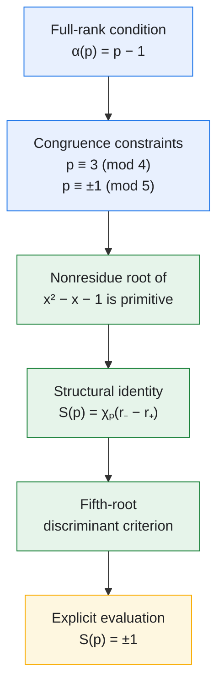
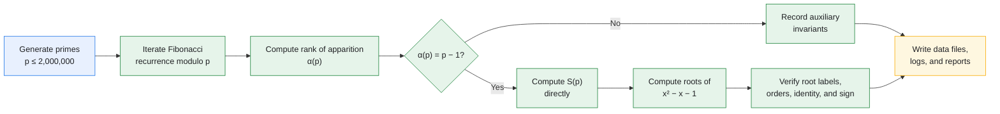

# An Explicit Evaluation of a Fibonacci Character Sum for Primes with Full Rank of Apparition

[](https://github.com/Majid-Ghandali/fibonacci-character-sum-full-rank/releases)
[](https://doi.org/10.5281/zenodo.22803009)
[](https://doi.org/10.5281/zenodo.21431565)
[-MIT-LIGHTBLUE.svg)](LICENSE)
[-CC%20BY%204.0-GREEN.svg)](Manuscript/LICENSE)
[](https://www.python.org/)

> **Research compendium** (manuscript + code + verification materials)
>
> *An Explicit Evaluation of a Fibonacci Character Sum for Primes with Full Rank of Apparition*
>
> **Majid Ghandali** · Independent Researcher, Tehran, Iran · 2026
> Submitted to the *Journal of Number Theory*

---

## Dual DOIs and dual licenses (read first)

This single GitHub repository is the working tree for **two independent Zenodo records** and uses **two licenses**.

| Kind | Identifier | What it covers | License |
|:--|:--|:--|:--|
| **Manuscript preprint** (version) | [10.5281/zenodo.22803009](https://doi.org/10.5281/zenodo.22803009) | LaTeX source, bibliography, typeset PDF (v1.0.0, 2026-09-16) | **CC BY 4.0** → [`Manuscript/LICENSE`](Manuscript/LICENSE) |
| **Manuscript concept** | [10.5281/zenodo.22803008](https://doi.org/10.5281/zenodo.22803008) | Always resolves to the latest preprint version | same |
| **Code & data archive** (version) | [10.5281/zenodo.21431565](https://doi.org/10.5281/zenodo.21431565) | FibChar v1.0.1 — suite, datasets, logs, tables | **MIT** → [`LICENSE`](LICENSE) |

**Cite the manuscript DOI** for mathematical results. **Cite the code DOI** for software, datasets, or re-runs. A new code release does not change the preprint DOI, and conversely.

---

## Overview

This repository contains:

- the **manuscript** (`Manuscript/`: `.tex`, `.bib`, compiled PDF);
- the **verification code** (`Code/Fibchar_v1-0-1.py`);
- a **headline verification snapshot** (`verification/`);
- extended **run outputs** (`results/`);
- repository metadata (`CITATION.cff`, dual `LICENSE` files, `requirements.txt`, compile helpers).

The mathematical object is the quadratic-character sum

$$
S(p)=\sum_{n=1}^{p-1}\chi_p(F_n),
$$

where $(F_n)$ is the Fibonacci sequence and $\chi_p$ is the quadratic character modulo an odd prime $p$. The main result evaluates $S(p)$ explicitly in the **full-rank regime** $\alpha(p)=p-1$, where $\alpha(p)$ is the rank of apparition of $p$.

> [!NOTE]
> Computations verify the stated identities on a finite range and support reproducibility. The theorems themselves are proved in the manuscript.

---

## Contents

- [Scientific Highlights](#scientific-highlights)
- [Main Theorem](#main-theorem)
- [Proof Structure](#proof-structure)
- [Verification Summary](#verification-summary)
- [Computational Pipeline](#computational-pipeline)
- [Reproducibility](#reproducibility)
- [Project Structure](#project-structure)
- [Installation](#installation)
- [Usage](#usage)
- [Compile the manuscript](#compile-the-manuscript)
- [Structural Checks](#structural-checks)
- [Auxiliary Empirical Observations](#auxiliary-empirical-observations)
- [Zenodo Archive](#zenodo-archive)
- [Citation](#citation)
- [License](#license)
- [Author](#author)

---

## Scientific Highlights

| | Result |
|:--|:--|
| **Object** | Quadratic-character sums attached to Fibonacci values |
| **Hypothesis** | Full rank of apparition: $\alpha(p)=p-1$ |
| **Congruence consequence** | $p\equiv 11$ or $19\pmod{20}$ |
| **Structural mechanism** | The nonresidue root of $x^2-x-1$ is primitive in $\mathbb{F}_p^\times$ |
| **Character-sum identity** | $S(p)=\chi_p(r_--r_+)$ |
| **Explicit evaluation** | $S(p)=+1$ if $p\equiv11\pmod{20}$; $S(p)=-1$ if $p\equiv19\pmod{20}$ |
| **Verification range** | Every prime $p\le 2{,}000{,}000$ |

The proof combines the arithmetic of the roots of $x^2-x-1$ over $\mathbb{F}_p$, a primitive-root reindexing of the Fibonacci sequence, and a discriminant criterion associated with fifth roots of unity.

---

## Main Theorem

Let $p\ge7$ be a prime satisfying

$$
\alpha(p)=p-1.
$$

Then

$$
p\equiv11\pmod{20}\quad\text{or}\quad p\equiv19\pmod{20},
$$

and

$$
S(p)=\sum_{n=1}^{p-1}\chi_p(F_n)=
\begin{cases}
+1, & p\equiv11\pmod{20},\\
-1, & p\equiv19\pmod{20}.
\end{cases}
$$

Structurally, if $r_-$ (resp. $r_+$) is the quadratic nonresidue (resp. residue) root of $x^2-x-1$ in $\mathbb{F}_p$, then

$$
S(p)=\chi_p(r_--r_+).
$$

Full rank forces $r_-$ to be a primitive root of $\mathbb{F}_p^\times$; that is the mechanism behind the evaluation.

---

## Proof Structure


```mermaid
flowchart TD
    A["Full-rank condition<br/>α(p) = p − 1"]
    B["Congruence constraints<br/>p ≡ 3 (mod 4)<br/>p ≡ ±1 (mod 5)"]
    C["Nonresidue root of<br/>x² − x − 1 is primitive"]
    D["Structural identity<br/>S(p) = χₚ(r₋ − r₊)"]
    E["Fifth-root<br/>discriminant criterion"]
    F["Explicit evaluation<br/>S(p) = ±1"]

    A --> B
    B --> C
    C --> D
    D --> E
    E --> F

    classDef condition fill:#E8F0FE,stroke:#1A73E8,color:#202124;
    classDef mechanism fill:#E6F4EA,stroke:#188038,color:#202124;
    classDef conclusion fill:#FEF7E0,stroke:#F9AB00,color:#202124;

    class A,B condition;
    class C,D,E mechanism;
    class F conclusion;
```

---

## Verification Summary

Verification was carried out for **every prime** $p\le 2{,}000{,}000$.

| Quantity | Value |
|:--|--:|
| Prime bound | $p\le 2{,}000{,}000$ |
| Primes tested | 148,933 |
| Split primes $p\equiv\pm1\pmod{5}$ | 74,461 |
| Full-rank primes $\alpha(p)=p-1$ | 26,407 |
| Full-rank density among split primes | $26{,}407/74{,}461\approx 35.46\%$ |
| Main-theorem matches | 26,407 |
| Main-theorem violations | **0** |

Headline snapshot (no re-run required): [`verification/corollary_B1_verification.csv`](verification/corollary_B1_verification.csv).

> [!TIP]
> Structural identities used in the proof were also checked computationally over the same range.

The verification is **non-circular**:

- $\alpha(p)$ is obtained by iterating the Fibonacci recurrence modulo $p$;
- $S(p)$ is the direct sum $\sum_{n=1}^{p-1}\chi_p(F_n)$;
- the closed formula of the theorem is only a comparison target, never an input.

---

## Computational Pipeline


```mermaid
flowchart LR
    A["Generate primes<br/>p ≤ 2,000,000"]
    B["Iterate Fibonacci<br/>recurrence modulo p"]
    C["Compute rank of apparition<br/>α(p)"]
    D{"α(p) = p − 1?"}
    E["Record auxiliary<br/>invariants"]
    F["Compute S(p)<br/>directly"]
    G["Compute roots of<br/>x² − x − 1"]
    H["Verify root labels,<br/>orders, identity, and sign"]
    I["Write data files,<br/>logs, and reports"]

    A --> B --> C --> D
    D -- No --> E --> I
    D -- Yes --> F --> G --> H --> I

    classDef input fill:#E8F0FE,stroke:#1A73E8,color:#202124;
    classDef process fill:#E6F4EA,stroke:#188038,color:#202124;
    classDef output fill:#FEF7E0,stroke:#F9AB00,color:#202124;

    class A input;
    class B,C,D,E,F,G,H process;
    class I output;
```

---

## Reproducibility

> [!IMPORTANT]
> Python **3.11+** is recommended. Dependencies are pinned in [`requirements.txt`](requirements.txt) (`numpy`, `pandas`, `numba`, `openpyxl`, `xlsxwriter`).

For each prime $p\le 2{,}000{,}000$ the suite can compute or check:

1. rank of apparition $\alpha(p)$;
2. the direct sum $S(p)=\sum_{n=1}^{p-1}\chi_p(F_n)$;
3. the class of $p$ modulo $20$;
4. roots of $x^2-x-1$ when it splits over $\mathbb{F}_p$;
5. residue / nonresidue labels of those roots;
6. multiplicative orders and primitivity;
7. the identity $S(p)=\chi_p(r_--r_+)$;
8. the sign from the fifth-root discriminant criterion.

Quadratic characters may be evaluated via QR lookup tables, bitwise Jacobi, or Euler's criterion (modular powering).

The full long-run deposit is Zenodo code DOI [10.5281/zenodo.21431565](https://doi.org/10.5281/zenodo.21431565).
In-repo guidance for the paper's checks: [`Code/README.md`](Code/README.md) and [`verification/README.md`](verification/README.md).

---

## Project Structure

Actual layout of this repository (paths are case-sensitive):

```text
.
├── Manuscript/                    # Preprint text (CC BY 4.0)
│   ├── main_full_rank.tex         # elsarticle source
│   ├── references_full_rank.bib
│   ├── main_full_rank.pdf
│   └── LICENSE                    # CC BY 4.0
│
├── Code/                          # Verification suite (MIT)
│   ├── Fibchar_v1-0-1.py          # principal entry point
│   └── README.md
│
├── verification/                  # Headline Corollary B1 snapshot
│   ├── corollary_B1_verification.csv
│   └── README.md
│
├── results/                       # Extended generated artifacts
│
├── CITATION.cff                   # Preprint citation metadata
├── LICENSE                        # MIT (code / data / scripts)
├── README.md
├── requirements.txt
├── compile.ps1                    # Windows manuscript build
├── compile.sh                     # Unix manuscript build
├── .gitignore
└── .gitattributes
```

> **Casing.** Folders are `Manuscript/` and `Code/` (capital initial). Keep that spelling in scripts, links, **and in `.gitattributes`** (Linux/CI are case-sensitive).

---

## Installation

### 1. Clone

```bash
git clone https://github.com/Majid-Ghandali/fibonacci-character-sum-full-rank.git
cd fibonacci-character-sum-full-rank
```

### 2. Virtual environment

```bash
python -m venv .venv
```

Windows PowerShell:

```powershell
.\.venv\Scripts\Activate.ps1
```

macOS / Linux:

```bash
source .venv/bin/activate
```

### 3. Dependencies

```bash
python -m pip install --upgrade pip
python -m pip install -r requirements.txt
```

---

## Usage

Entry point on disk: **`Code/Fibchar_v1-0-1.py`** (not a separate `main.py`).

**Self-test** (seconds):

```bash
python Code/Fibchar_v1-0-1.py --no-gui --self-test
```

**Full bound used in the manuscript** (long run):

```bash
python Code/Fibchar_v1-0-1.py --no-gui --N 2000000 --verify-b1
```

Windows PowerShell (same flags):

```powershell
python Code\Fibchar_v1-0-1.py --no-gui --self-test
python Code\Fibchar_v1-0-1.py --no-gui --N 2000000 --verify-b1
```

Optional: `--parallel --workers 8`, `--resume`. See `python Code/Fibchar_v1-0-1.py --help`.

Archived bulk outputs live under [`results/`](results/) and in the Zenodo code record.

---

## Compile the manuscript

Windows PowerShell:

```powershell
.\compile.ps1
```

macOS / Linux:

```bash
./compile.sh
```

Or manually inside `Manuscript/`:

```bash
pdflatex -interaction=nonstopmode main_full_rank.tex
bibtex main_full_rank
pdflatex -interaction=nonstopmode main_full_rank.tex
pdflatex -interaction=nonstopmode main_full_rank.tex
```

Requires `pdflatex`, `bibtex`, and the `elsarticle` class (TeX Live / MiKTeX).

---

## Structural Checks

For every full-rank prime in the tested range the suite confirms:

- [x] splitting of $x^2-x-1$ over $\mathbb{F}_p$;
- [x] residue / nonresidue labeling of the two roots;
- [x] the order identity $\operatorname{ord}(-r_-^2)=p-1$;
- [x] primitivity of $r_-$ in $\mathbb{F}_p^\times$;
- [x] $S(p)=\chi_p(r_--r_+)$;
- [x] the sign from the fifth-root discriminant criterion.

> [!TIP]
> Zero exceptions for primes $p\le 2{,}000{,}000$ with $\alpha(p)=p-1$.

---

## Auxiliary Empirical Observations

Verification logs also retain broader labels **E1–E10**.

> [!WARNING]
> These support documentation and possible later work. **They are not used in the proof of the main theorem.**

| Label | Description |
|:--|:--|
| E1 | $v_2(\pi)=v_2(p+1)+1$ on `DI` |
| E2 | $\pi=4\alpha$ and $\alpha$ odd on $Z\setminus\mathrm{DI}$ |
| E3 | $\pi=\alpha$ on `cm_only` |
| E4 | $\alpha\mid(p+1)$ for inert primes |
| E5 | $\alpha\mid(p-1)$ for split primes |
| E6 | Parity law for exponent $k$ controlled by $\chi_p(-1)$ |
| E7 | Complementary parity law for exponent $k$ |
| E8 | Full-rank sign theorem on the relevant full-rank class |
| E9 | Further structural regularities on selected subclasses |
| E10 | Further informational regularities on selected subclasses |

Identifiers `DI`, `Z`, and `cm_only` are class labels used in the verification logs.

---

## Zenodo Archive

| Archive | DOI | Role |
|:--|:--|:--|
| Manuscript preprint (fixed) | [10.5281/zenodo.22803009](https://doi.org/10.5281/zenodo.22803009) | Text v1.0.0 |
| Manuscript concept | [10.5281/zenodo.22803008](https://doi.org/10.5281/zenodo.22803008) | Latest preprint |
| Code archive (this release) | [10.5281/zenodo.21431565](https://doi.org/10.5281/zenodo.21431565) | FibChar v1.0.1 |

The **code concept DOI** (always points to the newest code version) is shown on the Zenodo page for `21431565` under *Versions* / *Cite as*. Record it in this README and in release notes when you confirm it from that page — do not invent the number.

### DOI policy

- Mathematical claims → manuscript DOI `22803009`
- Exact reproducibility materials for the published checks → code version DOI `21431565`
- "Latest code, any version" → code concept DOI (from Zenodo UI)

### Future code releases

1. Finalize tree, commit, tag (e.g. `v1.0.2`), push, GitHub Release.
2. Confirm Zenodo minted a new **version** DOI under the same concept.
3. Update this README (and release notes) with the new version DOI.
4. Change the manuscript's archived preprint DOI only if the **text** itself is revised and re-deposited.

---

## Citation

Please cite **both** the preprint and the code archive when both are used.

[`CITATION.cff`](CITATION.cff) holds machine-readable metadata for the **preprint**.

### Manuscript preprint

```bibtex
@misc{Ghandali2026Preprint,
  author       = {Ghandali, Majid},
  title        = {An Explicit Evaluation of a {F}ibonacci Character Sum for
                  Primes with Full Rank of Apparition},
  year         = {2026},
  version      = {v1.0.0},
  howpublished = {Zenodo preprint},
  doi          = {10.5281/zenodo.22803009},
  url          = {https://doi.org/10.5281/zenodo.22803009},
  note         = {Submitted to the Journal of Number Theory}
}
```

### Code \& reproducibility archive

```bibtex
@misc{Ghandali2026,
  author       = {Ghandali, Majid},
  title        = {{FibChar v1.0.1}: Reproducibility Materials for
                  ``An Explicit Evaluation of a {F}ibonacci Character Sum
                  for Primes with Full Rank of Apparition''},
  howpublished = {Zenodo},
  year         = {2026},
  version      = {v1.0.1},
  doi          = {10.5281/zenodo.21431565},
  url          = {https://doi.org/10.5281/zenodo.21431565},
  note         = {Reproducibility archive}
}
```

> [!NOTE]
> The key `Ghandali2026` matches [`Manuscript/references_full_rank.bib`](Manuscript/references_full_rank.bib). Keep them aligned if either changes.

---

## License

Copyright (C) 2026 Majid Ghandali.

| Content | Path | License |
|:--|:--|:--|
| Software, scripts, verification outputs, computational artifacts | `Code/`, `verification/`, `results/`, root tooling | **[MIT](LICENSE)** |
| Manuscript text (LaTeX, bibliography, PDF) | [`Manuscript/`](Manuscript/) | **[CC BY 4.0](Manuscript/LICENSE)** |

---

## Author

**Majid Ghandali**
Independent Researcher, Tehran, Iran

- Email: [majid.ghandali@gmail.com](mailto:majid.ghandali@gmail.com)
- ORCID: [0009-0001-1097-1770](https://orcid.org/0009-0001-1097-1770)
