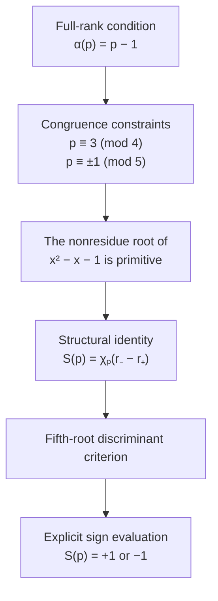

# An Explicit Evaluation of a Fibonacci Character Sum for Primes with Full Rank of Apparition

[](https://github.com/Majid-Ghandali/fibonacci-character-sum-full-rank/releases)
[](https://doi.org/10.5281/zenodo.21431565)
[](LICENSE)
[](https://www.python.org/downloads/release/python-3127/)
[](https://github.com/Majid-Ghandali/fibonacci-character-sum-full-rank/releases)

> **Companion repository for the mathematical manuscript**  
> *An Explicit Evaluation of a Fibonacci Character Sum for Primes with Full Rank of Apparition*
>
> **Majid Ghandali** · Independent Researcher · 2026  
> **Current reproducibility release:** [`v1.0.1`](https://github.com/Majid-Ghandali/fibonacci-character-sum-full-rank/releases/tag/v1.0.1)  
> **Citable archival DOI:** [10.5281/zenodo.21431565](https://doi.org/10.5281/zenodo.21431565)

---

## Overview

This repository contains the manuscript source, computational code, datasets, logs, generated tables, and reproducibility materials associated with the accompanying mathematical manuscript:

> *An Explicit Evaluation of a Fibonacci Character Sum for Primes with Full Rank of Apparition.*

The project studies the quadratic-character sum

$$
S(p)=\sum_{n=1}^{p-1}\chi_p(F_n),
$$

where $(F_n)$ is the Fibonacci sequence and $\chi_p$ denotes the quadratic character modulo an odd prime $p$.

The principal setting is the **full-rank regime**

$$
\alpha(p)=p-1,
$$

where $\alpha(p)$ is the rank of apparition of $p$ in the Fibonacci sequence.

> [!NOTE]
> The mathematical results are proved in the accompanying manuscript.  
> The computations in this repository verify the implementation, the stated identities, and the reproducibility of the reported finite-range calculations; they do not replace the proofs.

---

## Contents

- [Scientific Highlights](#scientific-highlights)
- [Main Theorem](#main-theorem)
- [Proof Mechanism](#proof-mechanism)
- [Verification Scope](#verification-scope)
- [Reproducibility Release v1.0.1](#reproducibility-release-v101)
- [Repository Structure](#repository-structure)
- [Requirements](#requirements)
- [Installation](#installation)
- [Usage](#usage)
- [Integrity Verification](#integrity-verification)
- [Zenodo Archive](#zenodo-archive)
- [Citation](#citation)
- [License](#license)
- [Author](#author)

---

## Scientific Highlights

| Item | Description |
|:--|:--|
| **Object** | Quadratic-character sums attached to Fibonacci values |
| **Hypothesis** | Full rank of apparition: $\alpha(p)=p-1$ |
| **Congruence consequence** | $p\equiv 11$ or $19\pmod{20}$ |
| **Structural mechanism** | The quadratic-nonresidue root of $x^2-x-1$ is primitive in $\mathbb F_p^\times$ |
| **Structural identity** | $S(p)=\chi_p(r_--r_+)$ |
| **Explicit evaluation** | $S(p)=+1$ for $p\equiv11\pmod{20}$ and $S(p)=-1$ for $p\equiv19\pmod{20}$ |
| **Verification range** | Every prime $p\le2{,}000{,}000$ |

The proof combines the arithmetic of the roots of

$$
x^2-x-1
$$

over $\mathbb F_p$, a primitive-root reindexing of the Fibonacci sequence, and a discriminant criterion associated with fifth roots of unity.

---

## Main Theorem

Let $p\ge7$ be a prime satisfying

$$
\alpha(p)=p-1.
$$

Then

$$
p\equiv11\pmod{20}
$$\qquad\text{or}\qquad$$
p\equiv19\pmod{20},
$$

and

$$
S(p)=\sum_{n=1}^{p-1}\chi_p(F_n)
=
\begin{cases}
+1, & p\equiv11\pmod{20},\\[2mm]
-1, & p\equiv19\pmod{20}.
\end{cases}
$$

More structurally, let $r_-$ be the quadratic-nonresidue root of $x^2-x-1$ in $\mathbb F_p$, and let $r_+$ be the quadratic-residue root. Then

$$
S(p)=\chi_p(r_--r_+).
$$

Under the full-rank hypothesis, the root $r_-$ is a primitive root of $\mathbb F_p^\times$. This primitivity is the central mechanism behind the explicit evaluation.

For complete definitions, hypotheses, proofs, and bibliographic context, see the manuscript source in [`Paper/`](Paper/).

---

## Proof Mechanism


```mermaid
flowchart TD
    A["Full-rank condition<br/>α(p) = p − 1"]
    B["Congruence constraints<br/>p ≡ 3 (mod 4)<br/>p ≡ ±1 (mod 5)"]
    C["The nonresidue root of<br/>x² − x − 1 is primitive"]
    D["Structural identity<br/>S(p) = χₚ(r₋ − r₊)"]
    E["Fifth-root discriminant criterion"]
    F["Explicit sign evaluation<br/>S(p) = +1 or −1"]

    A --> B
    B --> C
    C --> D
    D --> E
    E --> F
```

---

## Verification Scope

The computational framework verifies the implementation and the stated finite-range identities for every prime

$$
p\le2{,}000{,}000.
$$

For each relevant prime, the computations include, as applicable:

1. the rank of apparition $\alpha(p)$;
2. the direct Fibonacci character sum
   $$
   S(p)=\sum_{n=1}^{p-1}\chi_p(F_n);
   $$
3. the residue class of $p$ modulo $20$;
4. the roots of $x^2-x-1$ when the polynomial splits over $\mathbb F_p$;
5. quadratic residue/nonresidue labels of the roots;
6. multiplicative-order and primitive-root checks;
7. the structural identity
   $$
   S(p)=\chi_p(r_--r_+);
   $$
8. the sign predicted by the fifth-root discriminant criterion.

The full-range generated data include:

```text
results/fib_char_db_N2000000.csv
results/corollary_B1_verification.csv
results/CSV 's File/
results/Code's_output/
results/Excel_output/
results/latex_tables/
```

> [!IMPORTANT]
> The computed values are reproducibility and implementation checks.  
> They are not numerical proofs of the mathematical statements.

---

## Reproducibility Release v1.0.1

The current reproducibility release is:

> **FibChar v1.0.1 — Reproducibility Release**  
> DOI: [10.5281/zenodo.21431565](https://doi.org/10.5281/zenodo.21431565)

The versioned release materials are located in:

```text
results/release-v1.0.1/
```

They include:

- the versioned analysis program;
- an Appendix-A self-test log;
- a parallel smoke-test log for $N=10{,}000$;
- CSV, JSON, TXT, XLSX, and LaTeX-table outputs;
- an environment record;
- command-line help output;
- a release manifest;
- SHA-256 checksums.

The principal release files include:

```text
results/release-v1.0.1/
├── MANIFEST.md
├── SHA256SUMS-v1.0.1.txt
├── self-test-v1.0.1.log
├── smoke-N10000.log
├── cli-help-v1.0.1.txt
├── environment-v1.0.1.txt
├── version-v1.0.1.txt
├── fib_char_N10000_db.csv
├── fib_char_N10000_empirical_claims.csv
├── fib_char_N10000_main_theorem.csv
├── fib_char_N10000_report.txt
├── fib_char_N10000_report.xlsx
├── fib_char_N10000_root_order_sign_checks.csv
├── fib_char_N10000_summary.json
└── latex_tables/
```

For a detailed account of the release contents and verification procedure, see:

➡️ [`docs/reproducibility.md`](docs/reproducibility.md)

---

## Repository Structure

```text
.
├── Paper/                           # Manuscript source and bibliography
│   ├── main.tex
│   └── references.bib
│
├── code/                            # Versioned computational programs
│   ├── Fibchar_v1-0-0.py
│   └── Fibchar_v1-0-1.py
│
├── docs/                            # Documentation and bibliography checks
│   ├── reproducibility.md
│   └── bibcheck_output/
│
├── results/                         # Generated computational artifacts
│   ├── CSV 's File/
│   ├── Code's_output/
│   ├── Excel_output/
│   ├── latex_tables/
│   ├── phase6_5/
│   ├── phase6_6/
│   ├── phase6_v3/
│   ├── phase7/
│   ├── release-v1.0.1/
│   ├── sanity_n10000/
│   ├── corollary_B1_verification.csv
│   └── fib_char_db_N2000000.csv
│
├── .gitattributes
├── .gitignore
├── CITATION.cff
├── LICENSE
├── README.md
└── Requirements.txt
```

The authoritative release-specific artefacts are those in:

```text
results/release-v1.0.1/
```

---

## Requirements

The v1.0.1 release was prepared and tested with:

```text
Python 3.12.7
```

Required Python packages are listed in:

```text
Requirements.txt
```

> [!NOTE]
> For the closest reproduction of the release environment, use Python 3.12.7 and install the package versions specified in `Requirements.txt`.

---

## Installation

### 1. Clone the repository

```bash
git clone https://github.com/Majid-Ghandali/fibonacci-character-sum-full-rank.git
cd fibonacci-character-sum-full-rank
```

### 2. Check out the archived release tag

For exact correspondence with the Zenodo v1.0.1 archive, check out the release tag:

```bash
git checkout v1.0.1
```

Alternatively, with recent Git versions:

```bash
git switch --detach v1.0.1
```

### 3. Create a virtual environment

```bash
python -m venv .venv
```

Activate it on Windows PowerShell:

```powershell
.\.venv\Scripts\Activate.ps1
```

Activate it on macOS or Linux:

```bash
source .venv/bin/activate
```

### 4. Install dependencies

```bash
python -m pip install --upgrade pip
python -m pip install -r Requirements.txt
```

### 5. Confirm the Python version

```bash
python --version
```

For the release environment, this should report:

```text
Python 3.12.7
```

---

## Usage

The release-version analysis program is:

```text
code/Fibchar_v1-0-1.py
```

From the repository root, inspect the command-line interface with:

```bash
python code/Fibchar_v1-0-1.py --help
```

The archived command-line help output is retained at:

```text
results/release-v1.0.1/cli-help-v1.0.1.txt
```

The release-specific commands, expected outputs, and verification workflow are documented in:

➡️ [`docs/reproducibility.md`](docs/reproducibility.md)

> [!IMPORTANT]
> A complete computation through $p\le2{,}000{,}000$ may require substantial runtime and memory, depending on hardware and selected settings. The archived release includes output files, logs, manifests, and checksums, so re-executing the full computation is not necessary merely to inspect the reported data.

---

## Integrity Verification

The release includes a SHA-256 checksum file:

```text
results/release-v1.0.1/SHA256SUMS-v1.0.1.txt
```

The release manifest is:

```text
results/release-v1.0.1/MANIFEST.md
```

On Linux or macOS, verify checksums from the repository root with:

```bash
cd results/release-v1.0.1
sha256sum -c SHA256SUMS-v1.0.1.txt
```

On Windows PowerShell, individual files can be checked with:

```powershell
Get-FileHash .\results\release-v1.0.1\self-test-v1.0.1.log -Algorithm SHA256
```

Compare the resulting hash with the corresponding entry in:

```text
results/release-v1.0.1/SHA256SUMS-v1.0.1.txt
```

> [!NOTE]
> The repository uses `.gitattributes` rules designed to preserve original byte content for release artefacts. This is necessary for SHA-256 checksum verification.

---

## Zenodo Archive

The citable archival copy of the v1.0.1 reproducibility release is hosted on Zenodo:

| Release | DOI |
|:--|:--|
| **FibChar v1.0.1** | [10.5281/zenodo.21431565](https://doi.org/10.5281/zenodo.21431565) |

The Zenodo DOI identifies a fixed archived release. For reproducibility and citation, use the DOI corresponding to the exact release version used.

The GitHub release page is available at:

➡️ [GitHub Releases](https://github.com/Majid-Ghandali/fibonacci-character-sum-full-rank/releases)

---

## Citation

If this repository contributes to your research, please cite:

1. the accompanying mathematical manuscript; and
2. the archived reproducibility release.

Citation metadata is available in:

➡️ [`CITATION.cff`](CITATION.cff)

### Reproducibility archive

```bibtex
@software{Ghandali2026FibonacciCharacterSumArchive,
  author    = {Ghandali, Majid},
  title     = {{FibChar v1.0.1}: Reproducibility Materials for
               ``An Explicit Evaluation of a {F}ibonacci Character Sum
               for Primes with Full Rank of Apparition''},
  year      = {2026},
  version   = {v1.0.1},
  publisher = {Zenodo},
  doi       = {10.5281/zenodo.21431565},
  url       = {https://doi.org/10.5281/zenodo.21431565},
  note      = {Reproducibility archive}
}
```

### Accompanying mathematical manuscript

```bibtex
@misc{Ghandali2026FibonacciCharacterSum,
  author = {Ghandali, Majid},
  title  = {An Explicit Evaluation of a {F}ibonacci Character Sum for
            Primes with Full Rank of Apparition},
  year   = {2026},
  note   = {Manuscript}
}
```

For the manuscript’s internal bibliography, the reproducibility archive is cited using its established bibliography key:

```latex
\cite{Ghandali2026}
```

---

## License

This project is released under the [MIT License](LICENSE).

---

## Author

**Majid Ghandali**  
Independent Researcher  

Email: [majid.ghandali@gmail.com](mailto:majid.ghandali@gmail.com)  
ORCID: [0009-0001-1097-1770](https://orcid.org/0009-0001-1097-1770)
